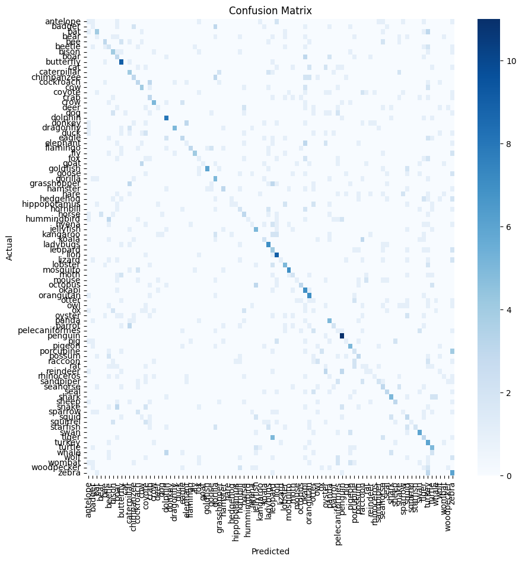
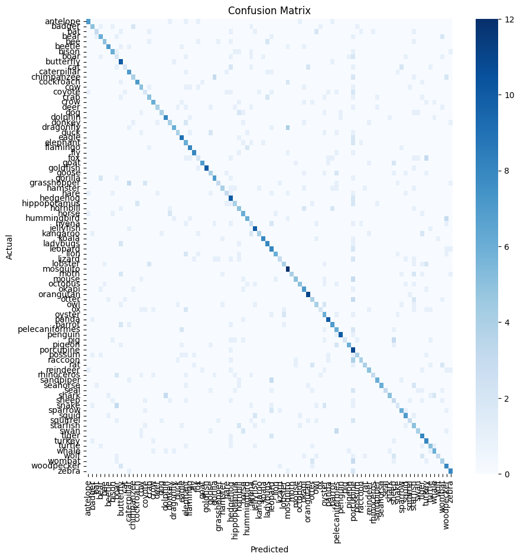
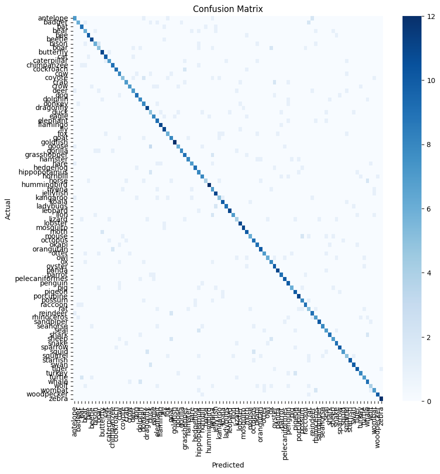

# Animal Classifier

Daniel Cajas - A01708637

## Project description

Using ML, the goal of this project is to correctly label the animal species present in an image. 

## Dataset description

The [Animal Image Dataset](https://www.kaggle.com/datasets/iamsouravbanerjee/animal-image-dataset-90-different-animals) from Kaggle was used. It has 60 images for each category and 90 different categories giving a total of 5400 images with variable resolutions and aspect ratios.

The classes are the following:

- antelope
- badger
- bat
- bear
- bee
- beetle
- bison
- boar
- butterfly
- cat
- caterpillar
- chimpanzee
- cockroach
- cow
- coyote
- crab
- crow
- deer
- dog
- dolphin
- donkey
- dragonfly
- duck
- eagle
- elephant
- flamingo
- fly
- fox
- goat
- goldfish
- goose
- gorilla
- grasshopper
- hamster
- hare
- hedgehog
- hippopotamus
- hornbill
- horse
- hummingbird
- hyena
- jellyfish
- kangaroo
- koala
- ladybugs
- leopard
- lion
- lizard
- lobster
- mosquito
- moth
- mouse
- octopus
- okapi
- orangutan
- otter
- owl
- ox
- oyster
- panda
- parrot
- pelecaniformes
- penguin
- pig
- pigeon
- porcupine
- possum
- raccoon
- rat
- reindeer
- rhinoceros
- sandpiper
- seahorse
- seal
- shark
- sheep
- snake
- sparrow
- squid
- squirrel
- starfish
- swan
- tiger
- turkey
- turtle
- whale
- wolf
- wombat
- woodpecker
- zebra

## Data preprocessing

### Data splitting

The first step was to separate the dataset into training and testing groups. This was done using the [split](./split.ipynb) script with a 80/20 ratio. 

### Data augmentation

Because the amount of data was limited, data augmentation was used. The following techniques were used:

- **Reshaping:** The input images were resized to 128x128 pixels.
- **Rescaling:** The pixel values were scaled to the range [0, 1] by dividing the pixel values by 255.
- **Rotation:** The images were randomly rotated by a small angle (between -10 and 10 degrees).
- **Width shift:** The images were randomly shifted horizontally by a small amount (between -20% and 20% of the width).
- **Zoom:** The images were randomly zoomed in or out by a small amount (between 0.7 and 1.3 times the original size).
- **Horizontal flip:** The images were randomly flipped horizontally with a 50% probability.
- **Color space conversion:** For the last two models, the images where moved from the RGB to the BGR color space. This is done to be able to use the VGG16 model, which was trained on BGR images.

## Model training

All models were trained for 100 epochs with a batch size of 32. The loss function used was categorical crossentropy and the optimizer used was Adam. The learning rate was set to 0.00001. 

## Models

### First Iteration

[First Model Notebook](./classifier.ipynb)

#### Model description

The first model was a sequential model with the following architecture:
- Conv2D layer with 32 filters, kernel size of (3, 3), and ReLU activation function
- MaxPooling2D layer with pool size of (2, 2)
- Conv2D layer with 32 filters, kernel size of (3, 3), and ReLU activation function
- MaxPooling2D layer with pool size of (2, 2)
- Flatten layer
- Dense layer with 256 units and ReLU activation function
- Dense layer with 90 units and softmax activation function

#### Results

| Metric    | Train | Test |
|-----------|-------|------|
| Loss      | 26.5  | 22.5 |
| Accuracy  | 3.07  | 3.44 |
| Precision | -     | 0.26 |
| Recall    | -     | 0.22 |
| F1        | -     | 0.20 |

#### Conclusions and next steps

The model was not able to learn anything useful. The accuracy and F1 score are very low. The confusion matrix did not show any pattern that could be exploited to make informed improvements.

Based on these observations the next steps proposed are to increase the model complexity so that the complexity of the task can be captured. Specifically, the VGG16 architecture as described in [1] was used.

### Second Iteration
[Second Model Notebook](./classifier_2.ipynb)

#### Model description
The second model was a sequential model with the following architecture:

- Conv2D layer with 64 filters, kernel size of (3, 3), and ReLU activation function
- MaxPooling2D layer with pool size of (2, 2)
- BatchNormalization layer

- Conv2D layer with 128 filters, kernel size of (3, 3), and ReLU activation function
- MaxPooling2D layer with pool size of (2, 2)
- BatchNormalization layer

- Conv2D layer with 256 filters, kernel size of (3, 3), and ReLU activation function
- Conv2D layer with 256 filters, kernel size of (3, 3), and ReLU activation function
- MaxPooling2D layer with pool size of (2, 2)
- BatchNormalization layer

- Conv2D layer with 512 filters, kernel size of (3, 3), and ReLU activation function
- Conv2D layer with 512 filters, kernel size of (3, 3), and ReLU activation function
- MaxPooling2D layer with pool size of (2, 2)
- BatchNormalization layer

- Conv2D layer with 512 filters, kernel size of (3, 3), and ReLU activation function
- Conv2D layer with 512 filters, kernel size of (3, 3), and ReLU activation function
- MaxPooling2D layer with pool size of (2, 2)
- BatchNormalization layer

- Flatten layer
- Dense layer with 4096 units and ReLU activation function
- Dropout layer with a rate of 0.4
- Dense layer with 4096 units and ReLU activation function
- Dropout layer with a rate of 0.4
- Dense layer with 90 units and softmax activation function

This follows the VGG16 architecture described in [1] with de addition of batch normalization layers after each max pooling layer and dropout layers after each dense layer to reduce overfitting.

#### Results

| Metric    | Train | Test |
|-----------|-------|------|
| Loss      | 80.6  | 46.9 |
| Accuracy  | 0.8   | 2.67 |
| Precision | -     | 0.54 |
| Recall    | -     | 0.47 |
| F1        | -     | 0.47 |

### Conclusions and next steps
The model was able to learn some useful features, but the accuracy and F1 score are still very low. Most importantly, the test accuracy and loss are considerably worse than the training accuracy and loss. This indicates that the model is overfitting to the training data. The confusion matrix shows that the model is able to classify some classes correctly, but it is still very far from being able to classify all classes correctly and seems to predict porcupine more often, although it is still not significant enough.

Based on the observations the next proposed step is using transfer learning with the VGG16 model. The VGG16 model was trained on the ImageNet dataset, which has a similar number of classes and images. The idea is to use the weights of the VGG16 model as a starting point for the training of the new model. This should help the model to learn useful features from the images and improve the accuracy. This weights will be frozen to avoid overfitting, they will just be used for feature extraction.

### Third Iteration

[Third Model Notebook](./classifier_3.ipynb)

#### Model description

The third model was a sequential model with the following architecture:
- VGG16 model with weights from ImageNet, frozen
- Flatten layer
- Dense layer with 4096 units and ReLU activation function
- Dropout layer with a rate of 0.4
- Dense layer with 4096 units and ReLU activation function
- Dropout layer with a rate of 0.4
- Dense layer with 90 units and softmax activation function

This follows the VGG16 architecture described in [1] with de addition of dropout layers after each dense layer to reduce overfitting.

#### Results

| Metric    | Train | Test |
|-----------|-------|------|
| Loss      | 83    | 68   |
| Accuracy  | 0.61  | 1.22 |
| Precision | -     | 0.7  |
| Recall    | -     | 0.68 |
| F1        | -     | 0.68 |

### Conclusions and next steps

We can see a significant improvement in testing accuracy, precision, recall and F1. Although the model is still overfitting, it is not as extreme as with the previous model. The confusion matrix is more readable now too and the weird leaning towards predicting porcupine is gone. The model is still not able to classify most of the classes correctly, but it is a step in the right direction. 

For the last iteration the idea is to reduce the number of nodes in the dense layers to reduce overfitting. The model will also be trained for more epochs to see if the accuracy can be improved.

### Fourth Iteration

[Fourth Model Notebook](./classifier_4.ipynb)

#### Model description
The fourth model was a sequential model with the following architecture:
- VGG16 model with weights from ImageNet, frozen
- Flatten layer
- Dense layer with 1024 units and ReLU activation function
- Dropout layer with a rate of 0.4
- Dense layer with 1024 units and ReLU activation function
- Dropout layer with a rate of 0.4
- Dense layer with 90 units and softmax activation function

### Results

| Metric    | Train | Test |
|-----------|-------|------|
| Loss      | 76.4  | 69.4 |
| Accuracy  | 0.87  | 1.2  |
| Precision | -     | 0.71 |
| Recall    | -     | 0.69 |
| F1        | -     | 0.69 |

### Conclusions

The training accuracy and loss are worst than the previous model but the test metrics all improved, by a very low margin but improved nonetheless. The model did take more time to train (100 extra epochs) and there is still overfitting but it was a step in the right direction.

## Discussion

When compared with other attempts of image classification with this limited dataset, the results are quite underwhelming. As seen in [this notebook](https://www.kaggle.com/code/muhammadfaizan65/90-animals-image-classification-efficientnetb3/notebook) The author was able to achieve an F1 score of 0.94 and validation accuracy of 93%. This was achieved using the EfficientNetB3 model with transfer learning and data augmentation. It seem that the VGG16 model is not the best choice for this task. The EfficientNetB3 model is more recent and has been shown to outperform the VGG16 model in most tasks as shown in [2].
## References

[1] K. Simonyan and A. Zisserman, "Very Deep Convolutional Networks for Large-Scale Image Recognition," arXiv preprint arXiv:1409.1556, Sep. 2014. [Online]. Available: https://arxiv.org/pdf/1409.1556

[2]	S. Padmakala and S. Uma Maheswari, ‘Comparative Analysis of VGG16 and EfficientNetB3 for Age Group Classification: A Study on Transfer Learning with Limited Data’, in 2024 8th International Conference on Electronics, Communication and Aerospace Technology (ICECA), 2024, pp. 1615–1619.